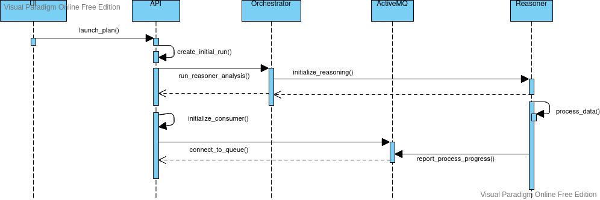

# amqp-research

> Test AMQP with one queue for all messages

## About

This project uses [Feathers](http://feathersjs.com). An open source web framework for building modern real-time applications.

## Getting Started

Getting up and running is as easy as 1, 2, 3.

1. Make sure you have [NodeJS](https://nodejs.org/) and [npm](https://www.npmjs.com/) installed.
2. Install your dependencies

   ```
   cd path/to/amqp-research
   npm install
   ```

3. Start your app in develop mode to see log messages

   ```
   npm run dev
   ```

## IMPORTANT

Next section assumes you're running a local image of ActiveMQ, you can use the one inside `scaffold` project.
By default the `user/password` combination to access AMQ console is `luminai/luminai`.

## Testing

1. Go to [ActiveMQ console](http://localhost:8161/admin/queues.jsp).
2. Create a Queue with the same name as in the `config/default.json` file (it's rubens_queue by default).
3. Send message to the Queue and see how they're consumed by the consumer created in `amqp.js` file.

## How it is working currently


